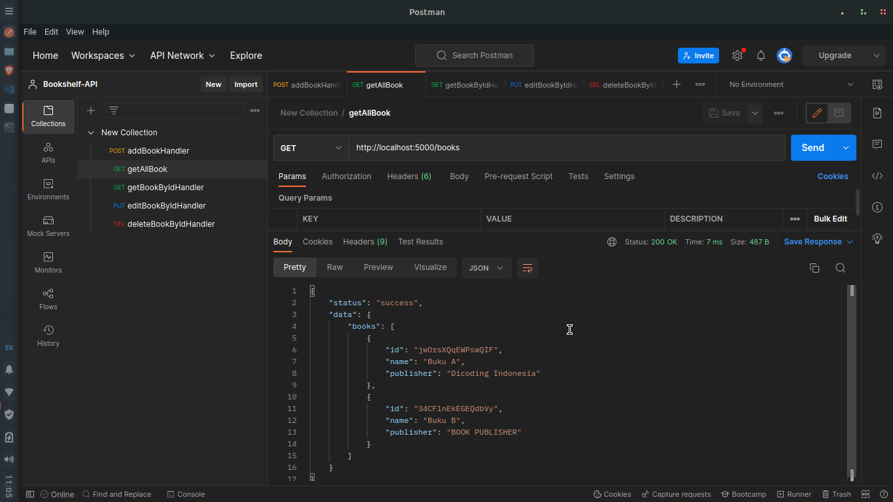
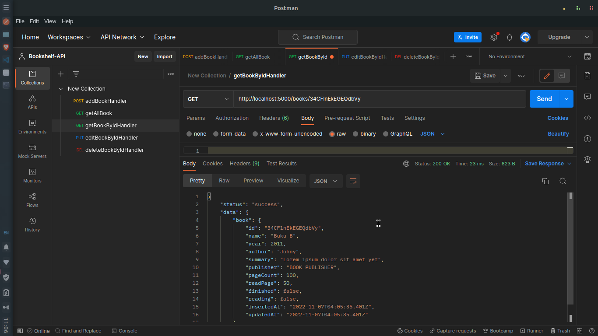
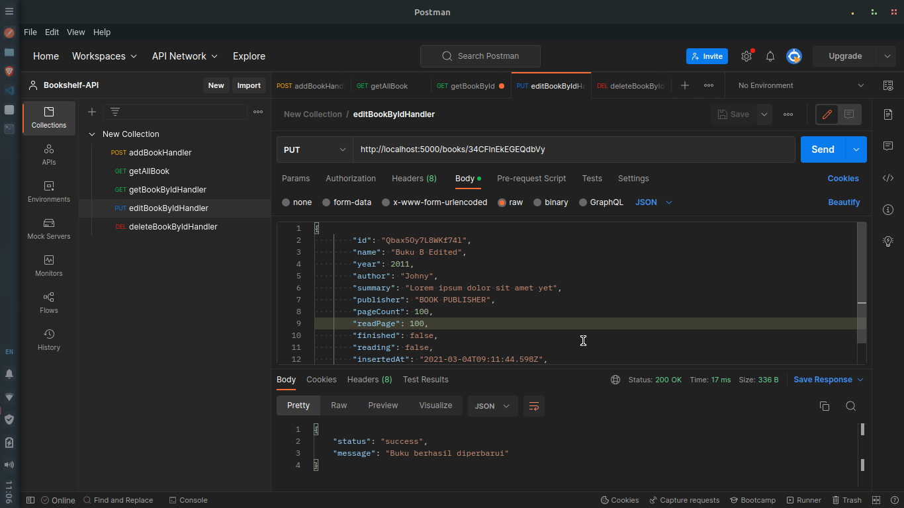
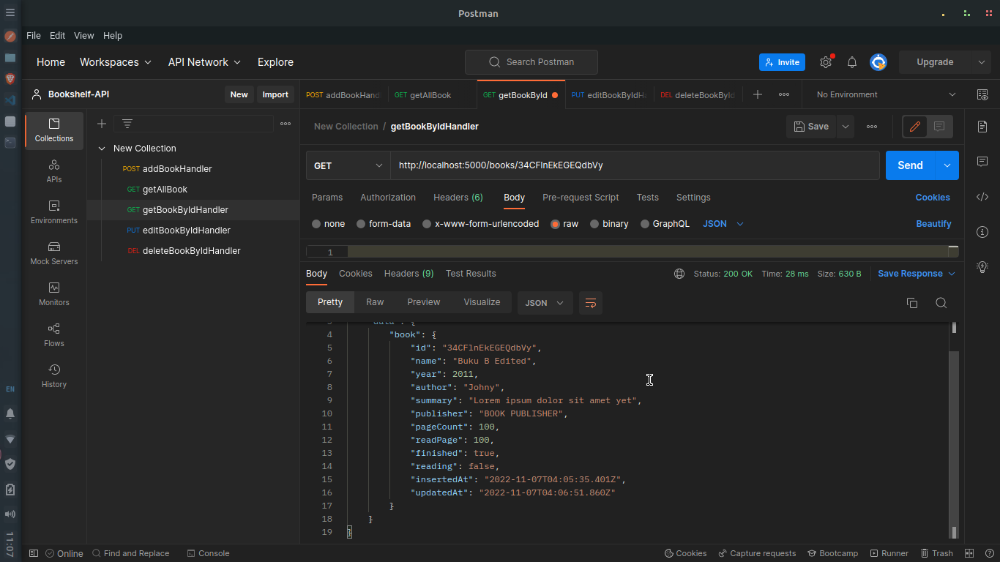
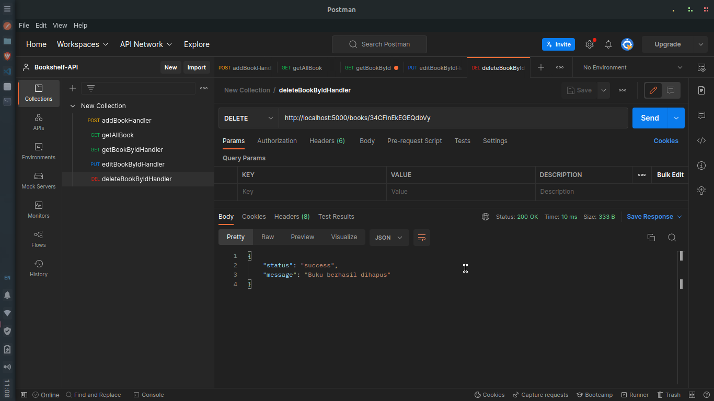
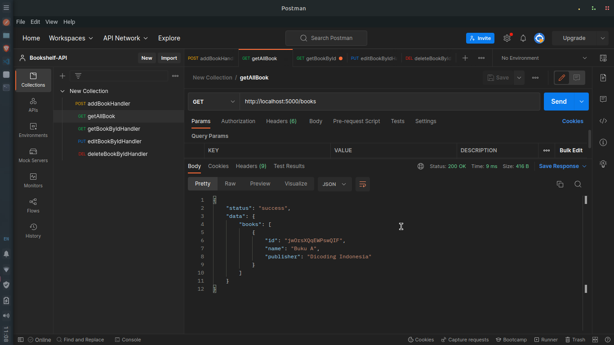

# SUBMISON DICODING Bookshelf API

## API dapat menyimpan buku

## API dapat menampilkan seluruh buku

## API dapat menampilkan detail buku

## API dapat mengubah data buku

## API dapat menghapus buku

